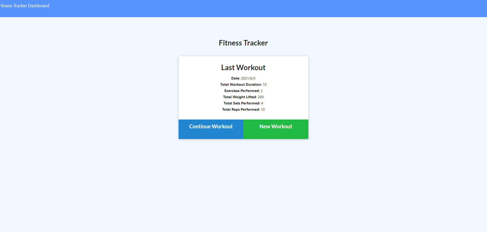

# Homework-May-29

==================================================================================================

## Home assignment

Background:

This is Homework due on May 8. Practice of mongo DataBase set up, and connection with deployed app. User able to view create and track daily workouts

---

Install

This project uses VS Code, GitBash, Mongo DataBase Atlas and NoSQL Please check you have correctly installed those program

Please ensure each of your program account created with SSH key or passwrod.

Please ensure running "npm i" to install all dependencies.

---

Usage （purpose）

This application will allow User able to view create and track daily workouts, multiple exercises in a workout on a given day, track the name，type, weight, sets, reps, and duration of exercise. If the exercise is a cardio exercise, I should be able to track my distance traveled.

Date input: Please enter "npm run seed" to input you date to your Database

Local App start: Please enter "node server" or "npm start" at your terminal. Please ensure installed all dependencies.

---

Contributing

for future reference

---

License

for future reference

---

## Review

You are required to submit BOTH of the following for review:

- The URL of the deployed application.
  https://guarded-mountain-38405.herokuapp.com/
- The URL of the GitHub repository that contains your code. Give the repository a unique name and include a README file that describes the project.
  https://github.com/sj212131/Workout_Tracker

